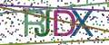

# canvas-captcha
[](https://travis-ci.org/Claude-Ray/canvas-captcha)

基于[node-canvas@2.x](https://github.com/Automattic/node-canvas)，主要作为示范，也可直接用于图片验证码产出。

> 建议直接引入`node-canvas`自行绘制验证码，项目尚需完善，欢迎PR。

## Why
- 相比于`gm`的cli调用，基于C++实现的`node-canvas`有性能优势
- canvas标准绘图，对前端开发者更友好（~~也许并没有~~）
- 更好的扩展性

## Samples

- rjdx

  

- hndd

  

## Install
```sh
npm install canvas2-captcha
```

## Usage
原生方法暂时只支持jpeg base64格式输出。

```js
const captcha = new Captcha(120, 50, 4);

const {dataURL, text} = captcha.createCaptcha();
```

但支持自由组合，期间可对ctx任意调整，或附加更多操作。
```js
// captcha初始化
const captcha = new Captcha(120, 50, 4);

// canvasRenderingContext2D初始化
const { canvas, ctx } = captcha.initCanvas();
// 举例，对ctx附加操作
ctx.globalAlpha = 0.8;
// 绘制文字
const text = captcha.drawText(ctx);
// 干扰线
captcha.drawLine(ctx);
// 干扰点
captcha.drawPoint(ctx);

// captcha或canvas都可用于图片输出
const dataURL = captcha.toDataURL(canvas);
```
